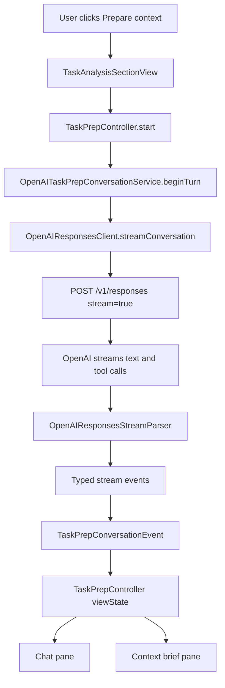
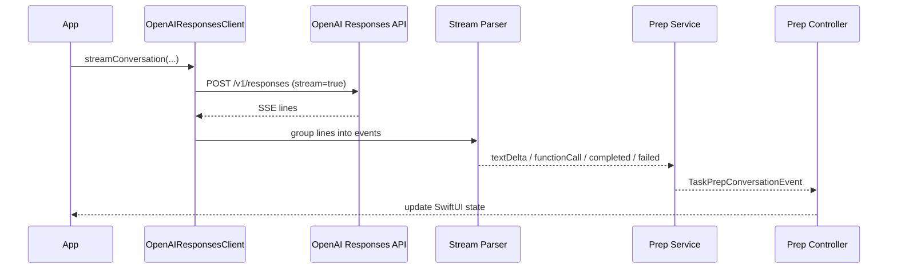
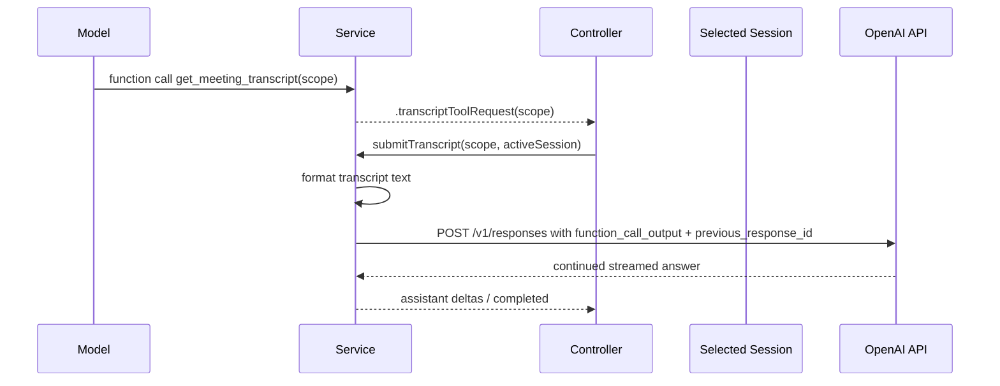
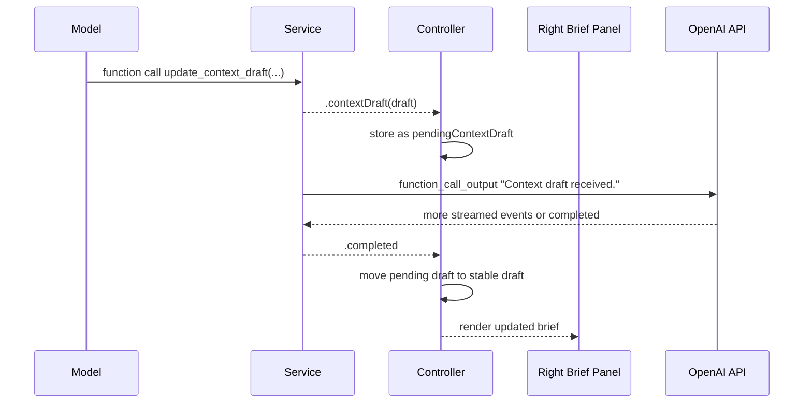
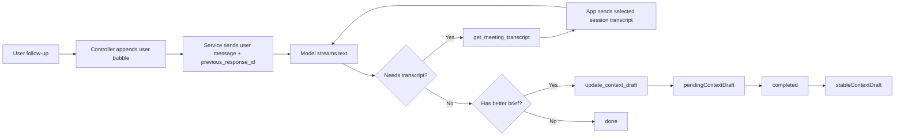

# Model Agent Flow

This doc explains the current shipped task-prep chat path in Heed.

It covers what happens after the user clicks `Prepare context`.

It does not cover the earlier `Compile tasks` pass.

## Short answer

The app does not send the whole meeting transcript when the prep chat starts.

It sends:

- one system prompt
- one user prompt built from the selected task
- three tools
- a streamed [text arrives in small pieces over one open network response] request to OpenAI

The model gets more transcript detail only if it calls the `get_meeting_transcript` tool [a named function the model can ask the app to run].

The model updates the right-side context brief by calling the `update_context_draft` tool [a named function the model can ask the app to run].

The app stores that draft in controller state. It does not save it to disk.

Follow-up messages do not rebuild the whole prompt from scratch. They send the new user message plus `previous_response_id` [the ID of the last OpenAI response, used to continue the same conversation]. That means the app is relying on the Responses API conversation chain [OpenAI keeps later turns linked to earlier turns] to carry prior context forward.

## Main files

- [`../heed/UI/TaskAnalysisSectionView.swift`](../heed/UI/TaskAnalysisSectionView.swift)
- [`../heed/Analysis/TaskPrepController.swift`](../heed/Analysis/TaskPrepController.swift)
- [`../heed/Analysis/TaskPrepConversationService.swift`](../heed/Analysis/TaskPrepConversationService.swift)
- [`../heed/Analysis/OpenAIResponsesClient.swift`](../heed/Analysis/OpenAIResponsesClient.swift)
- [`../heed/Analysis/OpenAIResponsesStream.swift`](../heed/Analysis/OpenAIResponsesStream.swift)
- [`../heed/UI/TaskPrepChatView.swift`](../heed/UI/TaskPrepChatView.swift)
- [`../heed/UI/TaskPrepContextPanelView.swift`](../heed/UI/TaskPrepContextPanelView.swift)

## Big picture



## Who owns what

| Part | Job |
| --- | --- |
| `TaskAnalysisSectionView` | Starts prep when the user clicks `Prepare context`. |
| `TaskPrepController` | Owns visible prep state in SwiftUI. That includes chat messages, pending draft, stable draft, and spawn approval state. |
| `OpenAITaskPrepConversationService` | Turns app actions into OpenAI streaming requests and turns streamed OpenAI events into app events. |
| `OpenAIResponsesClient` | Builds the HTTP request to `/v1/responses`. |
| `OpenAIResponsesStreamParser` | Parses SSE [server-sent events: named text events sent over one HTTP response] lines into typed events. |
| `TaskPrepContextPanelView` | Renders the brief from controller state. |

## End-to-end flow

### 1. The user opens prep

`TaskAnalysisSectionView` calls:

```swift
taskPrepController.start(task: task, in: displayedSession)
```

That happens when the user clicks `Prepare context`.

### 2. The controller resets visible state

`TaskPrepController.start(...)` stores:

- the selected `CompiledTask`
- the selected `TranscriptSession`

Then it starts a new streamed turn.

Before any network response arrives, it sets the visible state to:

- one empty assistant message bubble
- `turnState = .streaming`
- no stable brief yet

Think of this like opening a blank note card before the researcher starts speaking.

### 3. The service builds the first OpenAI request

`OpenAITaskPrepConversationService.beginTurn(...)` does three main things:

1. Cancels any older prep stream.
2. Stores `conversationContext` with the selected task and session.
3. Calls `makeStreamedTurn(...)` with:
   - the initial input items
   - no `previous_response_id`

The normal app uses:

```swift
OpenAIResponsesClient(model: "gpt-5.4")
```

The generic client default is `gpt-5.4-mini`, but the prep chat overrides that to `gpt-5.4`.

## What we send on the first turn

### Headers

The request goes to:

```text
POST https://api.openai.com/v1/responses
```

It includes:

- `Content-Type: application/json`
- `Authorization: Bearer <API key from Keychain>`
- `X-Client-Request-Id: <random UUID [a long random unique ID]>`

The API key comes from Keychain [the macOS secure secret store].

### JSON body shape

This is the real shape the app builds:

```json
{
  "model": "gpt-5.4",
  "input": [
    {
      "role": "system",
      "content": [
        {
          "type": "input_text",
          "text": "..."
        }
      ]
    },
    {
      "role": "user",
      "content": [
        {
          "type": "input_text",
          "text": "..."
        }
      ]
    }
  ],
  "tools": [
    { "name": "get_meeting_transcript", "type": "function", "strict": true, "parameters": { "...": "..." } },
    { "name": "spawn_agent", "type": "function", "strict": true, "parameters": { "...": "..." } },
    { "name": "update_context_draft", "type": "function", "strict": true, "parameters": { "...": "..." } }
  ],
  "max_output_tokens": 3200,
  "stream": true
}
```

### Exact system prompt

This is the actual system prompt in the code today:

```text
You help turn one meeting task into clear implementation context.
Use the transcript tool when you need more meeting detail.
Use the context draft tool when you have a better structured draft to share.
Use the spawn agent tool only when the user clearly approved it.
If you need missing information from the user, ask only the direct question in chat.
Do not narrate your process or mention internal tools.
Keep the chat natural and concise while the draft keeps improving in the background.
```

### Exact user prompt template

This is the actual user prompt template:

```text
Prepare implementation context for this task.

Task title: <task.title>
Task details: <task.details>
Task type: <task.type.rawValue>
Assignee hint: <task.assigneeHint>
Current evidence excerpt: <task.evidenceExcerpt>

Use get_meeting_transcript if you need more transcript detail.
```

### Important things we do not send on the first turn

We do not send:

- the full transcript
- transcript segment text by default
- the current session JSON
- the existing right-side brief
- the whole visible chat history

The first request is deliberately small.

It is like giving someone a task card first, then handing them the full meeting notes only if they ask.

## How the streamed response is read



`URLSession.shared.bytes(for:)` reads the response as a live byte stream.

The client turns that into lines.

The parser groups those lines into events such as:

- `response.output_text.delta`
- `response.output_item.added`
- `response.function_call_arguments.delta`
- `response.function_call_arguments.done`
- `response.completed`
- `response.failed`

The service then maps those low-level events into app-level events:

- `.assistantTextDelta(...)`
- `.contextDraft(...)`
- `.transcriptToolRequest(...)`
- `.spawnAgentRequest(...)`
- `.completed`

## How chat text reaches the UI

When the parser emits text deltas, the service yields:

```swift
.assistantTextDelta(delta)
```

The controller appends that text into the last assistant message.

That is why the assistant bubble grows live instead of waiting for one full answer.

## How the model gets more transcript context

Yes. This is a tool call.

The model asks for transcript detail by calling:

```text
get_meeting_transcript
```

with:

```json
{ "scope": "..." }
```

### Transcript tool round-trip



### What the app sends back for the tool

The app formats transcript lines like this:

```text
Requested scope: <scope>
Transcript:
1. [SEGMENT_ID <uuid>] [MIC 1s-2s] ...
2. [SEGMENT_ID <uuid>] [SYSTEM 3s-4s] ...
```

Important details:

- It reads only from the selected session.
- It includes segment UUIDs.
- It includes source labels like `MIC` and `SYSTEM`.
- It includes rough time ranges in seconds.

Those segment IDs matter because the model can attach them to brief evidence later.

## How the model updates the context brief

Yes. This is also a tool call.

The model updates the brief by calling:

```text
update_context_draft
```

with structured JSON fields:

- `summary`
- `goal`
- `constraints`
- `acceptanceCriteria`
- `risks`
- `openQuestions`
- `evidence`
- `readyToSpawn`

### Context brief round-trip



### What the controller does with that draft

During the turn:

- `pendingContextDraft = draft`
- `stableContextDraft` stays unchanged

When the turn ends with `.completed`:

- the pending draft is promoted to `stableContextDraft`
- the pending draft is cleared

This means the brief becomes "official" only after the turn finishes cleanly.

That is like keeping edits in pencil until the speaker finishes the sentence, then writing the final version in ink.

## What the right panel shows right now

This part is easy to miss.

The current code does **not** switch to the new pending draft if a stable draft already exists.

It currently does this:

- if there is a stable draft, show the stable draft
- if there is no stable draft yet, show the pending draft
- if a new pending draft arrives while a stable draft exists, show `Updating brief...`

So the current panel behavior is:

- first turn: pending draft can appear because no stable draft exists yet
- later turns: old stable draft stays visible until the new turn completes

That matches the code in `TaskPrepContextPanelView`.

## How the model knows the brief on later turns

The app does **not** manually inject the stable brief back into every new follow-up request.

For a follow-up message, the app sends:

- the new user message
- the tools
- `previous_response_id`

It does **not** rebuild the whole earlier prompt locally.

So the current design is:

- local UI state keeps the visible brief
- OpenAI conversation continuity uses `previous_response_id`

This is an inference from the code path, but it is a strong one. The service only stores `lastResponseID`, not a full replay log of prior prompts and tool outputs. That means the app is depending on the Responses API thread-like chain [later responses stay linked to earlier ones] to carry prior chat and prior tool calls forward.

## How follow-up messages work

When the user types into the chat box:

1. `TaskPrepChatView` calls `controller.sendUserMessage(...)`.
2. The controller appends the user bubble locally.
3. The controller appends a new empty assistant bubble.
4. The service sends a new streamed request with:
   - one `user` input item
   - the same tool list
   - `previous_response_id = lastResponseID`

That means a follow-up request is usually much smaller than the first request.

## How spawn approval works

The model can call:

```text
spawn_agent
```

with:

```json
{ "reason": "..." }
```

When that happens:

1. The service yields `.spawnAgentRequest(...)`.
2. The controller stores `pendingSpawnRequest`.
3. If the user has not approved yet, the controller sets `spawnStatus = .blockedWaitingForApproval`.
4. The panel shows the reason and an `Approve spawn` button.

Important current reality:

The app does **not** launch a real external agent from this flow yet.

Today it only records the request and the approval state.

## One user-visible turn can mean more than one OpenAI request

This is another subtle but important detail.

If the model uses tools, the app may send another `/v1/responses` request after the first streamed response finishes.

Why?

Because tool use is a handshake [a short back-and-forth confirmation between two parts of a system]:

1. model asks for a tool
2. app returns tool output
3. model continues from that tool output

So one prep turn can look like:

```text
request 1 -> model text/tool calls -> response.completed
request 2 -> function_call_output items + previous_response_id -> more model output
```

This happens for:

- `get_meeting_transcript`
- `update_context_draft`
- `spawn_agent`

For `update_context_draft` and `spawn_agent`, the follow-up `function_call_output` [the app's structured reply to a tool request] is just an acknowledgement [a short "I got it" message].

For `get_meeting_transcript`, the follow-up tool output carries real transcript text.

## Local state the app keeps while chatting

### In the controller

The controller keeps:

- visible messages
- `turnState`
- `pendingContextDraft`
- `stableContextDraft`
- `spawnStatus`
- `pendingSpawnRequest`
- the active task
- the active session

### In the service

The service keeps:

- `conversationContext.input`
- `conversationContext.lastResponseID`
- the active stream continuation [the object the service uses to push events into the controller]
- any pending transcript request
- queued tool outputs
- function-call identity bookkeeping [small tracking data that helps line up streamed tool events]

That bookkeeping exists because OpenAI may stream function-call events in pieces, and some later events may not repeat the `call_id`. The service matches them back together using `item_id` and `output_index`.

## Failure and safety guards

### Stale-turn guard

The controller assigns each turn a fresh `activeTurnID`.

If an older turn finishes late, its events are ignored.

That stops an old answer from overwriting a newer task.

### Stream guard

The service assigns each network stream a `currentStreamID`.

If a different stream becomes active later, old network events are ignored.

### Interrupted-stream guard

If the stream ends without `response.completed`, the service treats that as a failure.

The controller then:

- marks the assistant bubble as interrupted
- keeps any partial text
- clears the pending draft
- sets `turnState = .failed(...)`

## Persistence

The prep chat does not persist [save to disk] today.

The prep brief does not persist either.

If the user:

- closes the prep workspace
- switches sessions
- starts prep for another task

the controller resets the prep state.

## A compact visual



## Current code reality vs older doc wording

Older doc text said the panel renders the latest pending brief while a turn is streaming.

The current code is slightly different.

The current code keeps the stable brief visible during later turns and shows `Updating brief...` while the new pending draft is still in flight.

That is now documented here and in the updated frontend doc.
